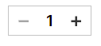

# 컴포넌트 속성 검사 및 테스트 과제

## 📌 컴포넌트 
마켓 칼리 시안 중 수량 카운트 컴포넌트를 구현




-  CountButton 컴포넌트
```
import React, { useState } from "react";

export default function CountButton({ initialCount = 1 }) {
  const [count, setCount] = useState(initialCount);

  const handleIncrement = () => {
    setCount(count + 1);
  };

  const handleDecrement = () => {
    if (count > 1) {
      setCount(count - 1);
    }
  };

  return (
    <div className="counter">
      <button className="button button-minus" onClick={handleDecrement} disabled={count === 1}>
        <svg width="30" height="30" viewBox="0 0 30 30" fill="none" xmlns="http://www.w3.org/2000/svg">
          <g id="icon-minus">
            <path id="Vector" d="M20 14V16H10V14H20Z" fill="current" />
          </g>
        </svg>
      </button>
      <span className="count">{count}</span>
      <button className="button button-plus" onClick={handleIncrement}>
        <svg width="30" height="30" viewBox="0 0 30 30" fill="none" xmlns="http://www.w3.org/2000/svg" >
          <g id="icon-plus">
            <path id="Vector" d="M16 10V14H20V16H16V20H14V16H10V14H14V10H16Z" fill="current" />
          </g>
        </svg>
      </button>
    </div>
  );
}

```

## 📌 컴포넌트 속성 검사
- prop-types 사용해 CountButton 컴포넌트 속성 검사
```
import PropTypes from "prop-types";

CountButton.propTypes = {
  initialCount: PropTypes.number.isRequired,
};
```

### ✍ 느낀점
- 어려웠습니다. 속성 검사를 이렇게 하는게 맞는 것인지 잘 모르겠습니다.
- 공부를 좀 더 해서 TypeScript를 사용해서 속성 검사도 진행해보고 싶습니다.
